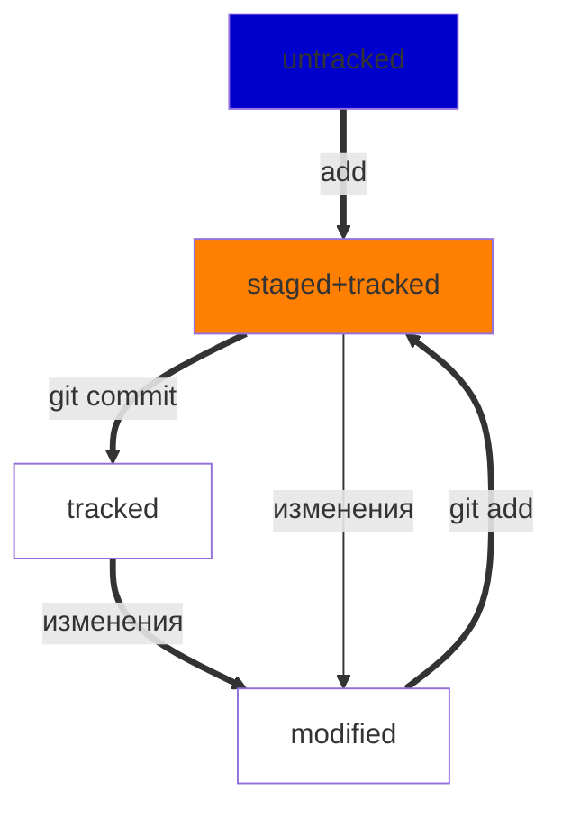

# Кароче, смотри - GIT

## Навигация
- **cd** - переместит тебя, куда тебе нужно, `cd ~` - вернет домой, а `cd ..` - переместит на папку выше.
- **ls** - покажет, что находится в текущей папке (если указан путь - в указанной папке). С тегом `-a` покажет скрытые файлы и папки.
- **pwd** - отобразит текущую директорую.

## Работа с файлами и папками
- **touch** - создаст файл.
- **mkdir** - папку.
- **rm** - удалит файл. С тегом `-r` удалит и папку (вместе со всей информацией внутри).
- **rmdir** - удалит папку, но только если она пустая.
- **cat** - вывести содержимое файла в консоль.
- **echo** - вывесии сообщение в консоль. При использовании с операторами `>>` и `>` запишет данные в файл. Например: `echo "текст" >> file.txt` - сохранить содержимое и добавить `текст` в конец файла. `echo "текст" > file.txt` - стереть содержимое файла и записать в него `текст`.

## Репозиторий
- **git init** - cоздать репозиторий в текущей папке, если я ничего не путаю.
- **git add** - добавить файлы для отслеживания изменений в них. Тег **--all** добавит все файлы в текущей папке.
- **git status** - посмотреть статус файлов и вообще, нужно ли что-то коммитить. `git status ingonre` - отобразить также игнорируемые файлы, перечисленные в .gitignore.
- **git commit -m 'описание коммита'** - сделать коммит. Не забудь как обычно про тег `-m`. 
- **git commit --amend --no-edit** - добавить изменения в последний коммит, не изменяя сообщение, `git commit --amend -m 'сообщение` - добавить и изменения в последний коммит и изменить сообщение. 
*p.s.* Выйти из редактора Vim: нажать `Esc` -> ввести `:qa!` -> нажать `Enter`.
- **git diff** - сравнить последнюю закоммиченную версию файла с текущей версией (не показывает изменения в файлах в статусе `staged`). `git diff --staged` - показать, что изменилось в проиндексированных файлах. `git diff A B` - сопоставить изменения коммитов, где `A` и `B` - хеши коммитов. `git diff HEAD~ HEAD` - сравнить текущий и предыдущий коммиты с помощью суффикса навигации `N~`, где `N` - количество коммитов назад во времени от текущего коммита.
- **git restore file.txt** - вернуть `file.txt` к последней версии закоммиченной версии. `git restore --staged file.txt` - перевести файл из состояния `staged` в состояние `untracked`.
- **git reset --hard b5725d8** - удалить все незакоммиченные изменения из staging и "рабочей зоны" вплоть до указанного коммита. 
- **git clone <SHH-key>** - клонировать репозиторий (автоматически свяжет локальный и удаленный репозиторий).

## Удаленный репозиторий
- **git remote add origin git@СсылочкаНаShhФайл.git** - связать локальный и удаленный репозиторий. Сначала, конечно, нужно создать удаленный репозиторий на гитхабе.
- **git remote -v** - проверить статус удаленного репозитория. В идеале должны быть типа такие строки:
```BASH
origin  git@github.com:Maxim-olegich/git-helper.git (fetch)
origin  git@github.com:Maxim-olegich/git-helper.git (push)
```
- **git push -u origin master** - первый пуш (`push` - синхронизировать локальный и удаленный репозиторий) должен быть такой. Затем просто `git push`.

## Статусы
- **untracked** - файлы, о которых гит знает, но которые он не отслеживает.
- **tracked** - файлы, изменения в которых гит отслеживает.
- **staged** - файлы, добавленные командой `add` в будущий коммит.
- **modified** - файлы, которые были изменены после коммита или после использования команды `add`.



## Лог
- **git log** - посмотреть журнал коммитов. В логе можно найти хеш коммита, автора и его электронную почту, дату коммита, а также описание совершенного коммита. 
- **git log --oneline** - сокращенный лог. Отображает сокращенную запись хеша (длинна может быть разная, но уникалность хеша сохраняется) и описание коммита.

## Хеш
- Хеш - основной идентификатор коммита, записанный с помощью алгоритма SHA-1. Хеш коммита можно посмотреть, вызвав команду `git log`

## head всему голова
- файл `HEAD` находится в папке `.git/` и хранит внутри себя ссылку на служебный файл `refs/heads/master` (или `/main`), который содержит хеш последнего коммита.

## Ветки
- **git branch** - посмотреть ветки репозитория. Звездочкой `*` помечена текущая ветка. `git branch <название ветки>` - создать новую ветку. `git branch -D <название ветки>` - удалить ветку.   	
- **git checkout <название ветки>** - переключится на другую ветку. `git checkout -b <название ветки>` - создать ветку и сразу переключиться на нее.
- **git merge <название ветки>** - произвести слияние текущей ветки с веткой, которую указал после `merge`.
- **git pull** - скачать изменения из удалённого репозитория. 

## Другие штуки
- **pull request** - это запрос на рассмотрение предлагаемых изменений и часть процесса ревью. После создания пул-реквеста ваши коллеги сделают ревью — оценят предложенные вами правки и оставят свои комментарии. По результатам ревью ваши правки могут быть приняты в основную ветку проекта или возвращены на доработку. Перед созданием нового пул-реквеста считается хорошей практикой перейти в главную ветку, «подтянуть» в неё изменения, а затем добавить эти изменения в вашу ветку с помощью git merge main.